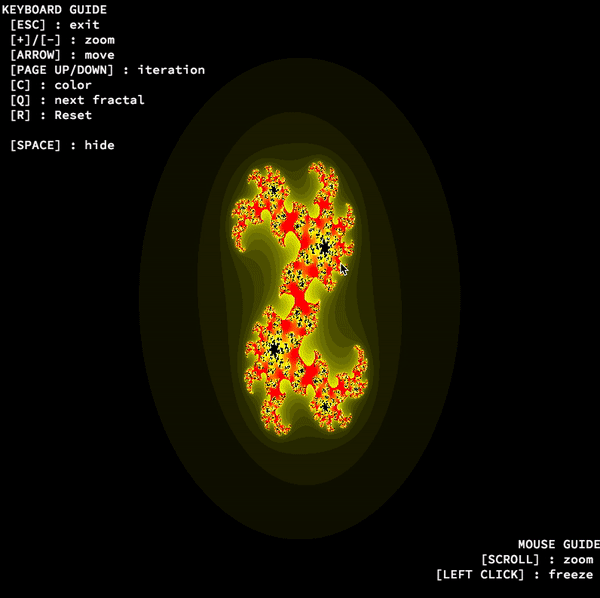

# Fractal
Create a small fractal exploration program.
[Fractal](https://en.wikipedia.org/wiki/Fractal)

#

#

## Usage
    usage: ./fractol [name of fractal]
       ./fractol [name of fractal] [name of fractal]

    fractal: [Julia] [Mandelbrot] [Tricorn]
         [Burning_Ship] [Glynn] [Phoenix]

## Mandatory part
- [x] Offer at least 3 different types of fractals, including the Julia set and the Mandelbrot set.
- [x] Make the parameter of the Julia set vary only with the mouse.
- [x] The mouse wheel zooms in and out, almost infinitely.
- [x] Use at least a few colors to show the depth of each fractal.
- [x] A parameter is passed on the command line to define what type of fractal will be viewed.

## Bonuse part
- [x] The zoom follow the actual mouse position
- [x] Moving with the arrows
- [x] Mae the color range shift.
- [x] Multi-threading implementation
